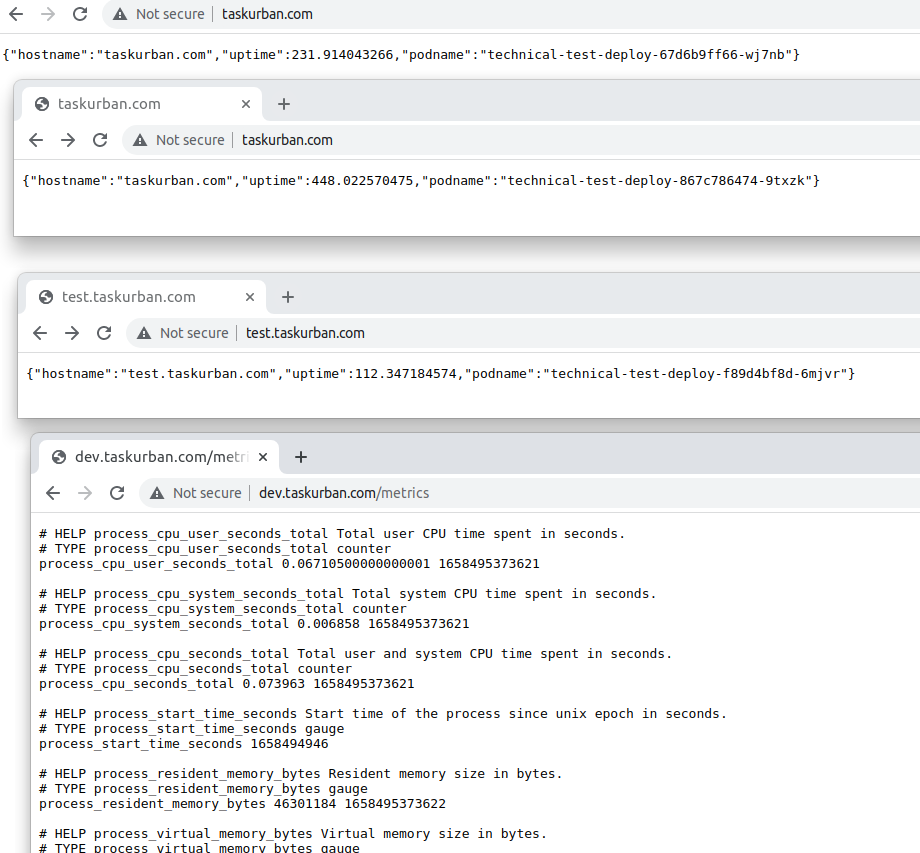
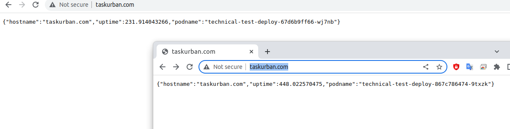
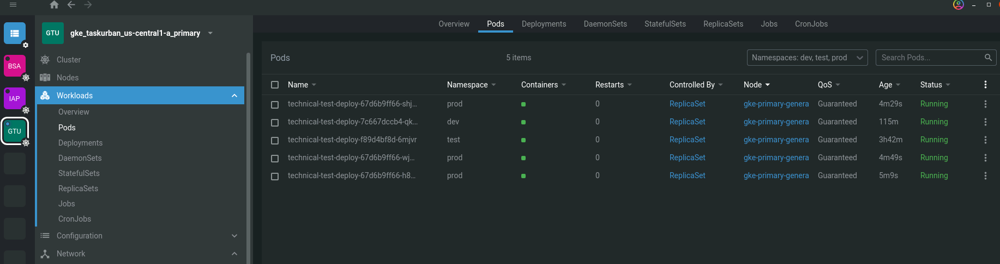

## Urban Task

This repo contains a [Terraform](https://www.terraform.io) code for running a Kubernetes cluster on [Google Cloud Platform (GCP)](https://cloud.google.com/) using [Google Kubernetes Engine (GKE)](https://cloud.google.com/kubernetes-engine/) and GitHub Action to Build, Publish, and Deploy an application. You can see the application metrics in Grafana by Prometheus.

## Table of contents

---

- [Urban Task](#urban-task)
- [Table of contents](#table-of-contents)
- [Quickstart](#quickstart)
  - [Create infrustructure](#create-infrustructure)
  - [Terraform code](#terraform-code)
  - [Build and Deploy application](#build-and-deploy-application)
  - [How use GitHub Actions to deploy application](#how-use-github-actions-to-deploy-application)
  - [Deployed application and services](#deployed-application-and-services)
  - [Changes in application](#changes-in-application)
- [Destroy infrustructure](#destroy-infrustructure)
- [Compromises](#compromises)
- [Homework task for Urban](#homework-task-for-urban)
  - [Requirements](#requirements)
  - [What gets evaluated](#what-gets-evaluated)

---

## Quickstart

Please review the `Requirements` before starting.

<details><summary>Requirements</summary>

**Requirements**

* Terraform and kubectl are [installed](#software-dependencies) on the machine where Terraform is executed.
* The Compute Engine and Kubernetes Engine APIs are [active](#enable-apis) on the project you will launch the cluster in.

**Software Dependencies**
- [kubectl](https://github.com/kubernetes/kubernetes/releases) >= 1.9.x

**Terraform and Plugins**
- [Terraform](https://www.terraform.io/downloads.html)    >= 1.0
- [Terraform Provider for GCP][terraform-provider-google] >= v3.41

**CLI `gcloud`**
- Some submodules use the [terraform-google-gcloud](https://github.com/terraform-google-modules/terraform-google-gcloud) module. By default, this module assumes you already have gcloud installed in your $PATH.  
- See the [module](https://github.com/terraform-google-modules/terraform-google-gcloud#downloading) documentation for more information.

**Enable APIs**  
- In order to operate with the Service Account you must activate the following APIs on the project where the Service Account was created:
  - Compute Engine API - compute.googleapis.com
  - Kubernetes Engine API - container.googleapis.com

</details></br>

### Create infrustructure

* We can use script `start.sh` to create Infrustructure.
* Or use the step by step below.


<details><summary>Use Google Cloud CLI</summary>

* Go to [Google Cloud Console](https://console.cloud.google.com/) and autorize.
* [Install the gcloud CLI](https://cloud.google.com/sdk/docs/install#deb)

```bash
# install gcloud CLI for Ubuntu
sudo apt-get install apt-transport-https ca-certificates gnupg
echo "deb [signed-by=/usr/share/keyrings/cloud.google.gpg] https://packages.cloud.google.com/apt cloud-sdk main" | sudo tee -a /etc/apt/sources.list.d/google-cloud-sdk.list
curl https://packages.cloud.google.com/apt/doc/apt-key.gpg | sudo apt-key --keyring /usr/share/keyrings/cloud.google.gpg add -
sudo apt-get update && sudo apt-get install google-cloud-cli

# Connect to Google CLI
gcloud init
```

* Create [new Project](https://cloud.google.com/resource-manager/docs/creating-managing-projects)

```bash
# Choose dafault Project
gcloud auth application-default login
# Enable the Cloud Storage API:
gcloud services enable storage.googleapis.com

# Create Bucket to save tfstate-files
region="us-central1"    # please check in file `tf-code/infr.tfvars`
bucket="tfstate_files"
gsutil mb -p taskurban -c REGIONAL -l $region -b on gs://$bucket
```

</details>


<details><summary>Use Terraform code</summary>

Variables to create prod Infrastructure in file `infr.tfvars`

```bash
# Clone repository urban-test
git clone ssh ...

# Go to folder `urban-test/tf-code` and run commands:
cd urban/tf-code/
terraform init
terraform plan -var-file ../infr.tfvars
terraform apply -var-file ../infr.tfvars -auto-approve
```

</details>

<details><summary>Connect to Urban-Cluster</summary>

```bash
# Install the gke-gcloud-auth-plugin binary
sudo apt-get install google-cloud-sdk-gke-gcloud-auth-plugin

# Update the kubectl configuration to use the plugin:
CLUSTER_NAME="urban-cluster"
location="us-central1-a"
gcloud container clusters get-credentials $CLUSTER_NAME --region $location  # see terraform output - region = us-central1-a
gcloud container clusters get-credentials $CLUSTER_NAME --zone=$location
# test connetion
kubectl get nodes
```

</details></br>


### Terraform code

Terraform code in folder `urban/tf-code/infrustructure` create infrustructure: Google Kubernetes Engine (GKE) Cluster, Network with Firewall and rules, Google Container Regygistry (GCR), and Nginx Ingress + Prometheus with Grafana by helm deploy.

<details><summary>Infrustructure</summary>

* **container-registry.tf** - GCR to store docker images
* **ingress.tf** - Ingress controller
* **k8s-cluster.tf** - GKE CLuster
* **main.tf** - TF requerments: backend in bucket, requiered providers and providers (google, kubernetes, helm), Datasources
* **network.tf** - VPC, Subnet, Router, NAT, Firewall
* **outputs.tf** - Output data (use to get Service Account Key)
* **prometheus.tf** - Prometheus helm deploy in `metrics` Namespace
* **service-account.tf** - Service account to create GKE Cluster and Deploy by GitHub Action. Used module [modules/service-account](tf-code/modules/service-account) to create Service Account and add Roles. [Module documentation](tf-code/modules/service-account/README.md)
* **variables.tf** - Used variables. Set variables in file like [infr.tfvars](tf-code/infr.tfvars)

</details></br>


### Build and Deploy application

When infrustructure ready you can use GitHub Actions to deploy application in Kubernetes Cluster.

**[GitHub Action Build and Deploy to GKE](https://github.com/Aleh-Mudrak/urban/actions/workflows/build-push.yml)**

**Requerments to use GitHub Actions**

* GitHib Repository **Secrets**:
  * **GCP_SA_KEY** - Service Account Key to connect in Cluster
  * **GKE_PROJECT** - Your `project_id` in Google Cloud
  * **GKE_CLUSTER** - Cluster Name
  * **GKE_ZONE** - Region of your Cluster
  * **SLACK_WEBHOOK_URL**` - [Webhook URL](https://api.slack.com/apps/A02MHFFJK26/incoming-webhooks?) to connect in [Slack API](https://api.slack.com) and send messages

<details><summary>Commands to get GitHub Repository Secrtets</summary>

You have to go to folder `urban/tf-code/infrustructure` and run commands bellow:

```bash
# Get Secrets to GitHub Repository
echo -e "=== GitHub Repository Secrtets\n"
echo -e "GCP_SA_KEY=\n$(terraform output -raw service_account_sa_key)\n"
echo -e "GKE_PROJECT=\n$(terraform output -raw project_id)\n"
echo -e "GKE_CLUSTER=\n$(terraform output -raw cluster_name)\n"
echo -e "GKE_ZONE=\n$(terraform output -raw region)\n"
echo -e "\n=== Copy output and paste in GitHub Secrets.\n"
```

</details></br>

### How use GitHub Actions to deploy application

You have to go in [GitHub Actions page](https://github.com/Aleh-Mudrak/urban/actions/workflows/build-push.yml) and run `Build and Deploy to GKE` like on picture bellow.

**!!! Add picture**


* Choose `Environment` (test|dev|prod)
* And Replicas of the application (1-5)

**Workflow Steps**
* **Checkout** - Clone GitHub repository
* **Check_input_Variables** - Check entered data on this step  
* **Slack_Notification_Start** - After that you recieve message in Slack about Start deploy and initial parameters on step  
* **Setup_gcloud** - Setup gcloud CLI and Configure Docker to use the gcloud command-line tool as a credential
* **get_gke_credentials** - Get the GKE credentials so we can deploy to the cluster
* **Setting_Environment_Variables** - Configure Setting Environment Variables to Build, Push, and Deploy the application
* **Build** - Build the application 
* **Publish** - Push to GCR this application Docker image.  
* **Deploy** - Deploy in Cluster this application.
* **Slack_Notification_Finish** - Last step send message to Slack with deploy results and link.

Docker image has image name: 
* `gcr.io/$PROJECT_ID/$APP_NAME:$PROJECT_VERSION`

Where 
* **PROJECT_ID** - Google Cloud ProgectID
* **APP_NAME** - Application Name
* **PROJECT_VERSION** - Created from `branch_name-commit_hash`:
  * **branch_name** - Get from started GHActions brunch
  * **commit_hash** - Short Commit Hash


### Deployed application and services

Deploy configuration files you can find in folder `urban/deploy-app/`

* deploy.yml - Deploy the application
* ingress.yml - Ingress service to connect the application from the Internet
* promMetrics.yml - Deploy a pod to get metrics from the application
* service.yml - Service to connect the applicastion pods


</br><details><summary>Deploy results</summary>






</details></br>


### Changes in application

* Was added string in `urban/application/package.json` file to run application by command `npm start`
  * String 7: `"start": "node app/index.js",`
* Added Prometheus-metrics code in file `urban/application/app/index.ts` to get metrics in Prometheus
  * String 5-32:

```ts
const express = require('express')
const metrics = require('express-prometheus-metrics')
const app = express();

app.use(
  metrics({
    // The route to expose the metrics on
    metricsPath: '/metrics',

    // How often prometheus should collect the metrics
    interval: 60 * 1000,

    // Any routes that should be ignored
    excludeRoutes: [],

    // Percentiles for request duration summary
    requestDurationBuckets: [0.5, 0.9, 0.95, 0.99],

    // Time buckets for request duration histogram
    requestDurationHistogramBuckets: [0.005, 0.01, 0.025, 0.05, 0.1, 0.25, 0.5, 1, 2.5, 5, 10],

    // Size buckets for request
    requestSizeBuckets: [5, 10, 25, 50, 100, 250, 500, 1000, 2500, 5000, 10000],

    // Size buckets for response
    responseSizeBuckets: [5, 10, 25, 50, 100, 250, 500, 1000, 2500, 5000, 10000],
  }),
)
```


## Destroy infrustructure

To destroy infrastructure you can use this command in folder `urban/tf-code/infrustructure`.

```bash
# Go to folder `urban/tf-code/infrustructure` and run command:
cd urban/tf-code/infrustructure
terraform destroy -var-file ../infr.tfvars -auto-approve 
```


---

## Compromises

* Variables in Terraform code can be sorted into objects using a `map` or an `object` terraform type
* 

---

## Homework task for Urban

The goal of the task is to demonstrate how a candidate can create an environment with terraform. You should commit little and often to show your ways of working

### Requirements

- The environment should get created in Google Cloud Platform
- Create a VPC native Kubernetes cluster
- Host the provided Node.js application provided in the `app` folder in the created cluster with 3 replicas
- Expose the provided application to the public internet
- Include at least 1 custom module in Terraform
- Add the prometheus-client to the provided application and expose one metric on a `/metrics` endpoint
- Write down some thoughts about what compromises you've applied (if any) and how would you like to improve the solution

### What gets evaluated

- Code quality
- Solution architecture
- Whether the code is "production-ready" (i.e. the environment starts and works as expected)


