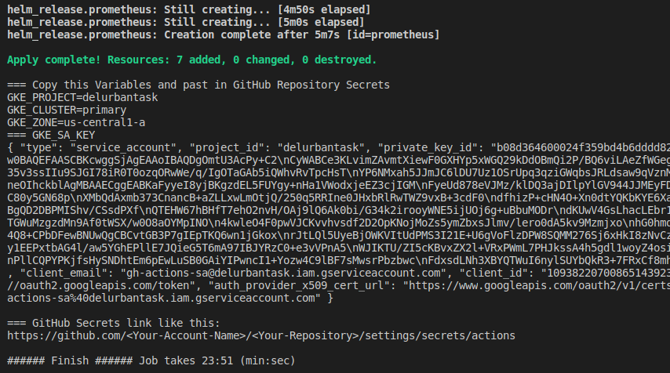

## Urban Task

This repo contains a [Terraform](https://www.terraform.io) code for running a Kubernetes cluster on [Google Cloud Platform (GCP)](https://cloud.google.com/) using [Google Kubernetes Engine (GKE)](https://cloud.google.com/kubernetes-engine/) and GitHub Action to Build, Publish, and Deploy an application. You can see the application metrics in Grafana by Prometheus.

## Table of contents

---

- [Urban Task](#urban-task)
- [Table of contents](#table-of-contents)
- [Quickstart](#quickstart)
  - [Building Infrastructure in GCP](#building-infrastructure-in-gcp)
    - [Building Infrastructure by script](#building-infrastructure-by-script)
    - [Building Infrastructure step by step](#building-infrastructure-step-by-step)
  - [Terraform code](#terraform-code)
  - [How use GitHub Actions to deploy application](#how-use-github-actions-to-deploy-application)
    - [**Add GitHub Repository Secrets**](#add-github-repository-secrets)
    - [**Deploy App**](#deploy-app)
    - [**Workflow Steps**](#workflow-steps)
    - [**Docker image name**](#docker-image-name)
  - [**Deploy configuration**](#deploy-configuration)
  - [Show application from web](#show-application-from-web)
  - [Changes in application](#changes-in-application)
- [Destroy infrustructure](#destroy-infrustructure)
- [Homework task for Urban](#homework-task-for-urban)
  - [Requirements](#requirements)
  - [What gets evaluated](#what-gets-evaluated)
- [List of decisions/compromises](#list-of-decisionscompromises)

---

## Quickstart

Please review the `Requirements` before starting.

<details><summary>Requirements</summary>

**Requirements**

* Terraform and kubectl are [installed](#software-dependencies) on the machine where Terraform is executed.
* The Compute Engine and Kubernetes Engine APIs are [active](#enable-apis) on the project you will launch the cluster in.

**Google Cloud Account**
- You have to loginin your Google Cloud Account
- Create new Project
- [Add billing on this Project](https://support.google.com/googleapi/answer/6158867?hl=en)

**CLI `gcloud`**
- Some submodules use the [terraform-google-gcloud](https://github.com/terraform-google-modules/terraform-google-gcloud) module. By default, this module assumes you already have gcloud installed in your $PATH.  
- See the [module](https://github.com/terraform-google-modules/terraform-google-gcloud#downloading) documentation for more information.

**Enable APIs**  
- In order to operate with the Service Account you must activate the following [APIs on the project](https://console.cloud.google.com/flows/enableapi?apiid=artifactregistry.googleapis.com,container.googleapis.com&_ga=2.89666075.1490439926.1658674592-2107436295.1657877440) where the Service Account was created:
  - Compute Engine API - compute.googleapis.com
  - Kubernetes Engine API - container.googleapis.com

**Software Dependencies**
- [kubectl](https://github.com/kubernetes/kubernetes/releases) >= 1.9.x

**Terraform and Plugins**
- [Terraform](https://www.terraform.io/downloads.html)    >= 1.0
- [Terraform Provider for GCP][terraform-provider-google] >= v3.41

</details></br>

### Building Infrastructure in GCP

Google Cloud Account and New Project
  * You have to login in your [Google Cloud Account](https://console.cloud.google.com/)
  * [Create new Project](https://cloud.google.com/resource-manager/docs/creating-managing-projects)
  * [Add billing on this Project](https://support.google.com/googleapi/answer/6158867?hl=en)
    * [Go to the API Console to enable billing](https://console.developers.google.com/)

#### Building Infrastructure by script

We can use the script `start.sh`  to create GCP Infrustructure. 
You have to run the script from folder [scripts](/scripts/).  
(`it takes about 25-30 minutes`). 

  * Before start you have to connect to gcloud CLI in terminal:
    * `gcloud init` - connect to your Google Account
    * `gcloud auth application-default login` - Choose your Google Project
  * Install the `gke-gcloud-auth-plugin binary` (*Ubuntu solution*)
    * `sudo apt-get install google-cloud-sdk-gke-gcloud-auth-plugin`
  * You can change initial parameters. They will be used in the script.
    * [tf-code/variables/infr.tfvars](tf-code/variables/infr.tfvars) - Cluster Terraform variables include `project_id` and `region`
    * [tf-code/infrustructure/main.tf](tf-code/infrustructure/main.tf) - `bucket` name and `prefix`
    * [tf-code/variables/deploy.tfvars](tf-code/variables/deploy.tfvars) - Deploy to Cluster: Namespaces, Ingress and Prometheus
    * [tf-code/deploy/main.tf](tf-code/deploy/main.tf) - Deploy `prefix`
  * Start script [start.sh](scripts/start.sh) from folder [scripts](/scripts/)
    * `cd scripts`
    * `./start.sh`
  * Add GitHub Secrets to your Repository
    * When `start.sh` script finished work you can see secrets in terminal
    * You have to [add this secrets](#how-use-github-actions-to-deploy-application) in your GitHub Repository

</br>

#### Building Infrastructure step by step

The second way is to build infrastructure step by step. (*Tested on Ubuntu 20*)

<details><summary>Use Google Cloud CLI</summary>

* Go to [Google Cloud Console](https://console.cloud.google.com/) and autorize.
* [Install the gcloud CLI](https://cloud.google.com/sdk/docs/install#deb)

```bash
# install gcloud CLI for Ubuntu
sudo apt-get install apt-transport-https ca-certificates gnupg
echo "deb [signed-by=/usr/share/keyrings/cloud.google.gpg] https://packages.cloud.google.com/apt cloud-sdk main" | sudo tee -a /etc/apt/sources.list.d/google-cloud-sdk.list
curl https://packages.cloud.google.com/apt/doc/apt-key.gpg | sudo apt-key --keyring /usr/share/keyrings/cloud.google.gpg add -
sudo apt-get update && sudo apt-get install google-cloud-cli

# Connect to Google CLI
gcloud init
```

* Create [new Project](https://cloud.google.com/resource-manager/docs/creating-managing-projects)

```bash
# Choose dafault Project
gcloud auth application-default login
# Enable the Cloud Storage API:
gcloud services enable storage.googleapis.com

# Create Bucket to save tfstate-files
region="us-central1"    # please check in file `tf-code/variables/infr.tfvars`
bucket="tfstate_files"
gsutil mb -p taskurban -c REGIONAL -l $region -b on gs://$bucket

# Clone repository urban-test
git clone git@github.com:Aleh-Mudrak/urban.git
```

</details>


<details><summary>Use Terraform code</summary>

Variables to create Cloud Infrastructure in file [tf-code/variables/infr.tfvars](tf-code/variables/infr.tfvars)

```bash
# Go to folder `tf-code/infrustructure` and run commands:
cd tf-code/infrustructure
terraform init
terraform apply -var-file ../variables/infr.tfvars -auto-approve
```

After that you have to Deploy Ingress and Prometheus. Parameters in file [tf-code/variables/deploy.tfvars](tf-code/variables/deploy.tfvars)

```bash
# Go to folder `tf-code/deploy` and run commands:
cd ../deploy
terraform init
terraform apply -var-file ../variables/deploy.tfvars -auto-approve
```

</details>

<details><summary>Connect to Urban-Cluster</summary>

Then you have to Connect to Cluster

```bash
# Install the gke-gcloud-auth-plugin binary
sudo apt-get install google-cloud-sdk-gke-gcloud-auth-plugin

# Update the kubectl configuration to use the plugin:
cd ../infrustructure
CLUSTER_NAME=$(terraform output -raw cluster_name)
cluster_location=$(terraform output -raw cluster_location)
gcloud container clusters get-credentials $CLUSTER_NAME --region $cluster_location

# test connetion
kubectl get nodes
```

</details></br>


### Terraform code

Terraform code in folders:
* `tf-code/infrustructure` - create infrustructure: Google Kubernetes Engine (GKE) Cluster, Network with Firewall and rules, Google Container Regygistry (GCR), and Service Account
* `tf-code/infrustructure` - Create Kubernetes Namespaces: test, dev, prod. Deploy Nginx Ingress and Prometheus with Grafana by helm deploy.
* `tf-code/modules/service-account` - by this Module create Service Account 

<details><summary>Infrustructure</summary>

* **container-registry.tf** - GCR to store docker images
* **k8s-cluster.tf** - GKE CLuster
* **main.tf** - TF requerments: backend, requiered providers and providers (google, kubernetes, helm), Datasources
* **network.tf** - VPC, Subnet, Router, NAT, Firewall
* **outputs.tf** - Output data
* **service-account.tf** - Service account to create GKE Cluster and Deploy by GitHub Action. Used module [modules/service-account](tf-code/modules/service-account) to create Service Account and add Roles. [Module documentation](tf-code/modules/service-account/README.md)
* **variables.tf** - Used variables. Set variables in file like [infr.tfvars](tf-code/variables/infr.tfvars)

</details>

<details><summary>Deploy</summary>

* **ingress.tf** - Ingress controller deploy in Namespace `ingress`
* **main.tf** - TF requerments: backend, requiered providers and providers (google, kubernetes, helm), Datasources
* **namaspaces.tf** - Create Namespaces in Cluster: `test`, `dev`, `prod`
* **prometheus.tf** - Prometheus deploy in Namespace `metrics`
* **variables.tf** - Used variables. Set variables in file like [deploy.tfvars](tf-code/variables/deploy.tfvars)

</details>

<details><summary>Module service-account</summary>

* **main.tf** - Create Service Account and Add Roles, Create SA-KEY
* **outputs.tf** - Output data
* **variables.tf** - Used variables. Set variables in file like [infr.tfvars](tf-code/variables/infr.tfvars)

</details></br>


### How use GitHub Actions to deploy application

When infrustructure ready you can use [GitHub Actions](https://github.com/Aleh-Mudrak/actions/workflows/build-push.yml) to deploy application in Kubernetes Cluster.

#### **Add GitHub Repository Secrets**

GitHub Secrets link like this: `https://github.com/<Your-Account-Name>/<Your-Repository>/settings/secrets/actions`

  * **GCP_SA_KEY** - Service Account Key to connect in Cluster
  * **GKE_PROJECT** - Your `project_id` in Google Cloud
  * **GKE_CLUSTER** - Cluster Name
  * **GKE_ZONE** - Region of your Cluster
  * **SLACK_WEBHOOK_URL**` - [Webhook URL](https://api.slack.com/apps/A02MHFFJK26/incoming-webhooks?) to connect in [Slack API](https://api.slack.com) and send messages

<details><summary>Screenshots and Commands to get GitHub Repository Secrtets</summary>

</br>

* You can Get Secrets by the script [output.sh](scripts/output.sh). You have to run the script from folder `scripts\`.

* Example of output from script:



* GitHub Secrets link like this: `https://github.com/<Your-Account-Name>/<Your-Repository>/settings/secrets/actions`
* Screenshot from GitHub Repository Secrets page


</details></br>


#### **Deploy App**

<details><summary>Deploy App</summary>

You have to go in [GitHub Actions page](https://github.com/Aleh-Mudrak/urban/actions/workflows/build-push.yml) and run `Build and Deploy to GKE` like on picture bellow.


* Choose `Environment` (test|dev|prod)
* And `Replicas` of the application (1-5)


#### **Workflow Steps**
* **Checkout** - Clone GitHub repository
* **Check_input_Variables** - Check entered data on this step  
* **Slack_Notification_Start** - After that you recieve message in Slack about Start deploy and initial parameters on step  
* **Setup_gcloud** - Setup gcloud CLI and Configure Docker to use the gcloud command-line tool as a credential
* **get_gke_credentials** - Get the GKE credentials so we can deploy to the cluster
* **Setting_Environment_Variables** - Configure Setting Environment Variables to Build, Push, and Deploy the application
* **Build** - Build the application 
* **Publish** - Push to GCR this application Docker image.  
* **Deploy** - Deploy in Cluster this application.
* **Slack_Notification_Finish** - Last step send message to Slack with deploy results and link.


#### **Docker image name**
Docker image has image name: 
* `gcr.io/$PROJECT_ID/$APP_NAME:$PROJECT_VERSION`

Where 
* **PROJECT_ID** - Google Cloud ProgectID
* **APP_NAME** - Application Name
* **PROJECT_VERSION** - Created from `branch_name-commit_hash`:
  * **branch_name** - Get from started GHActions brunch
  * **commit_hash** - Short Commit Hash

</details></br>

### **Deploy configuration**

Deploy configuration files you can find in folder [application/deploy-app/](application/deploy-app/)

* `deploy.yml` - Deploy the application
* `ingress.yml` - Ingress service to connect the application from the Internet
* `promMetrics.yml` - Deploy a service-monitor to get metrics from the application
* `service.yml` - Service to connect the applicastion pods


</br><details><summary>Deploy results</summary>


</details></br>


### Show application from web

Add in your hosts file string like that: `34.69.160.165 taskurban.com`  
Command to chane in Linux: `sudo vim /etc/hosts`


Where 
* `34.69.160.165` - IP address from Slack message;
* `taskurban.com` - URL from Slack message.


### Changes in application


* Was added string in `application/package.json` file to run application by command `npm start`
  * String 7: `"start": "node app/index.js",`
* Added Prometheus-metrics code in file `application/app/index.ts` to get metrics in Prometheus
  * String 5-32:

<details><summary>added code to application/app/index.ts</summary>

```ts
const express = require('express')
const metrics = require('express-prometheus-metrics')
const app = express();

app.use(
  metrics({
    // The route to expose the metrics on
    metricsPath: '/metrics',

    // How often prometheus should collect the metrics
    interval: 60 * 1000,

    // Any routes that should be ignored
    excludeRoutes: [],

    // Percentiles for request duration summary
    requestDurationBuckets: [0.5, 0.9, 0.95, 0.99],

    // Time buckets for request duration histogram
    requestDurationHistogramBuckets: [0.005, 0.01, 0.025, 0.05, 0.1, 0.25, 0.5, 1, 2.5, 5, 10],

    // Size buckets for request
    requestSizeBuckets: [5, 10, 25, 50, 100, 250, 500, 1000, 2500, 5000, 10000],

    // Size buckets for response
    responseSizeBuckets: [5, 10, 25, 50, 100, 250, 500, 1000, 2500, 5000, 10000],
  }),
)
```

</details></br>

* Created Dockerfile to build image
  * Added commands for Prometheus metrics:
    * `RUN npm add express-prometheus-metrics`
    * `RUN npm add pkginfo`


## Destroy infrustructure

To destroy infrastructure you can use the script [destroy.sh](scripts/destroy.sh) in folder `scripts`. 
You have to run the script from folder `scripts/`.  
(`it takes about 15-20 minutes`)


---

## Homework task for Urban

* [Application and Task](documentation/hw)

The goal of the task is to demonstrate how a candidate can create an environment with terraform. You should commit little and often to show your ways of working

### Requirements

- The environment should get created in Google Cloud Platform
- Create a VPC native Kubernetes cluster
- Host the provided Node.js application provided in the `app` folder in the created cluster with 3 replicas
- Expose the provided application to the public internet
- Include at least 1 custom module in Terraform
- Add the prometheus-client to the provided application and expose one metric on a `/metrics` endpoint
- Write down some thoughts about what compromises you've applied (if any) and how would you like to improve the solution

### What gets evaluated

- Code quality
- Solution architecture
- Whether the code is "production-ready" (i.e. the environment starts and works as expected)


---

## List of decisions/compromises

Any solution can be improved, but usually we don't have free time for this and we have to choose a more effective way to solve our tasks. In this task, I created the GKE infrastructure and described two ways to deploy it, and added scripts to get variables for GitHub Actions and to destroy it. I prefer to create easy-to-understand solutions by adding comments to the code and documentation where possible.

* The folders in the repo have been sorted and moved by category and logic.
* All parameters were in variables.tf as default.
  * Not important parameters were deleted from `infr.tfvars`
    * Cluster parameters
    * Network parameters
    * Service Account parameters
  * Bash script get initial parameters from `infr.tfvars`
* Used for_each to create multiple node pools in a cluster.
* Used for_each to create multiple firewall rules.
* Data parameters in the `main.tf` file used to connect in the Cluester on the step Deploy.
* Output data the same used to connect in the Cluster on the step Deploy and in the GitHub Actions.
* Prometheus scrape has been resolved. Issue was in the service labels.


Compromises:
* Start scripts can be improved:
  * Get variables from Google Secret Manager;
  * Add Secret GKE_SA_KEY in the GitHub Repository;
  * Add more checks
* Terraform:
  * Terraform Cloud is good solution to use with a GitHub repository;
  * The application and the GH Action have to be in one repo, TF-code in another;
  * TF-code Infrustructure and Deploy have to separate to diffirent git repository;
  * Can add output variables in Deploy part;
  * Can add option to disable deploy Prometheus;
  * Firewall rules can be moved to the Deploy TF-code part;
  * Can add more modules: 
    * Create GKE Cluster and Nodes; 
    * Network with VPC, Subnet, NAT, and Router; 
    * Firewall
  * You can use Terragrunt if you will use a lot of GKE Clusters .
  * Variables in Terraform code can be added into the objects.
* GitHub Actions can be improved with:
  * steps: test-application, cash, deploy by git tag-version;
  * Helm charts;
  * Some Terraform Secrets can be moved to GitHub Secrets by GH CLI.
* Prod and test+dev deploy have to be in different Clusters.
